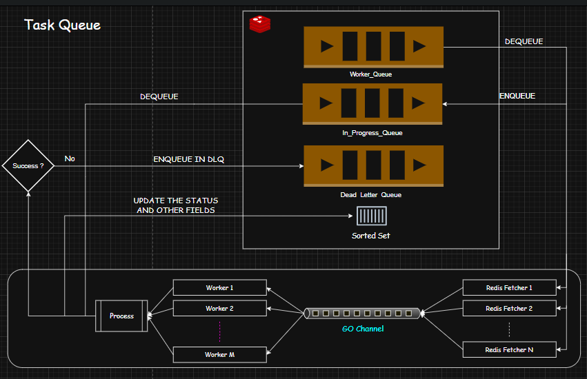

## Task Queue

A backend job processing service built using Redis, Go (Golang), and a worker system. This service provides a robust job queueing mechanism with retry, failure handling, and DLQ (dead-letter queue).

## What is this?

GoRedisQueue is a simple task queue system built in Go, backed by Redis. It allows you to push jobs to a queue and process them asynchronously using worker goroutines.

Background jobs are used in production systems to handle tasks like sending emails, processing images, or running billing logic — work that shouldn’t block the main app flow.

## Features

- **Redis-backed Queue:** Jobs are enqueued into Redis and processed by multiple workers concurrently.
- **Job Retry & Exponential Backoff:** Failed jobs are retried with exponential backoff before being marked as failed.
- **Panic Recovery:** Workers gracefully handle panics, preventing job loss.
- **DLQ (Dead Letter Queue):** Failed jobs are moved to a DLQ for further inspection and manual intervention.
- **High Concurrency:** Multiple fetchers and workers operate in parallel to handle a high throughput of jobs.


## 🛠 Technologies Used

- **Go (Golang):** Main programming language.
- **Redis:** For job queuing and management.
- **Logrus:** Structured logging.
- **Docker:** For containerization.
- **Postman:** For API testing (example requests provided below).

## Architecture Diagram


| Queue Name          | Purpose                                |
| ------------------- | -------------------------------------- |
| `work_queue`        | Main job queue (waiting to be fetched) |
| `in_progress_queue` | Jobs currently being processed         |
| `dlq_queue` (opt)   | Failed jobs (DLQ)                      |

## How It Works?
This project is built around a Redis-backed job queue system with worker concurrency, retries, and DLQ. Here's how the flow works:

### 1. Job Submission
-> Jobs are submitted via the HTTP API (POST /jobs).

-> A job is assigned a unique ID (UnixMicro timestamp).

-> It is saved in Redis (HSET) and pushed to the work_queue (RPUSH).


### 2. Fetchers (Redis Fetcher Goroutines)
-> Multiple fetchers continuously listen on work_queue using BRPopLPush.

-> Each fetched job is moved to in_progress_queue to avoid loss during processing.

-> The fetcher reads job details from Redis and pushes the job into a buffered Go channel (jobChan) for workers.

### 3. Workers
-> Multiple worker goroutines pull jobs from jobChan and start processing.

-> Each job is passed to a function (taskFunc) that handles job-specific logic.

### 4. Retry & Backoff
-> If a job fails, it is retried with exponential backoff.

-> The job’s attempts field is incremented and updated in Redis.

-> After max retries, the job is marked as "failed" and moved to the Dead Letter Queue (DLQ).

### 6. Completion
-> If a job succeeds, it is marked as "completed", and removed from in_progress_queue.

## APIs
##  1.📬 Submit a Job

This API allows clients to enqueue a new job into the system. Jobs are processed asynchronously by background workers.

### 🔧 Method

**POST** `/jobs`

### 🧾 Request Body

```json
{
  "type": "Encode Video",
  "payload": {
    "file_url": "https://example.com/video.mp4",
    "format": "mp4"
  }
}
```
---

## 2.🔍Get Job by ID

Fetches the status and metadata of a specific job using its unique ID.

### 🔧 Method

**GET** `/jobs/:id`

### 🔑 Path Parameter

- **id** (`number`) — The unique identifier of the job to retrieve.

---

## 3.📄 List Jobs

Retrieves a list of jobs based on optional filters like status, type, and pagination parameters.

### 🔧 Method

**GET** `/jobs`

### 🔑 Query Parameters

- **page** (`integer`, optional) — The page number for pagination (default: 1).
- **limit** (`integer`, optional) — The number of jobs to return per page (default: 10).
- **status** (`string`, optional) — Filter jobs by status (`queued`, `processing`, `failed`, `completed`).
- **type** (`string`, optional) — Filter jobs by type (e.g., `Encode Video`, `Image Resize`).

### 📝 Example Request
``` 
GET /jobs?page=1&limit=20&status=completed&type=Encode Video 
```